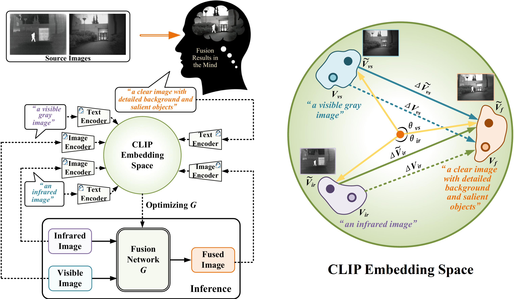
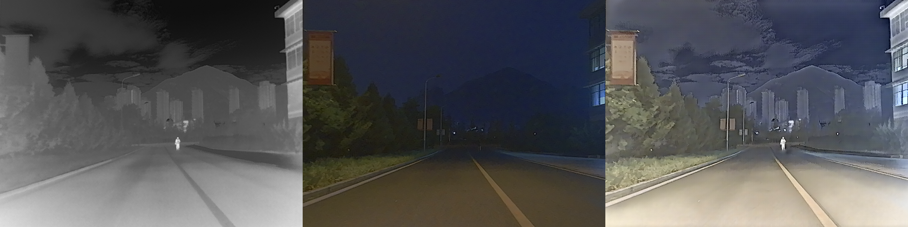
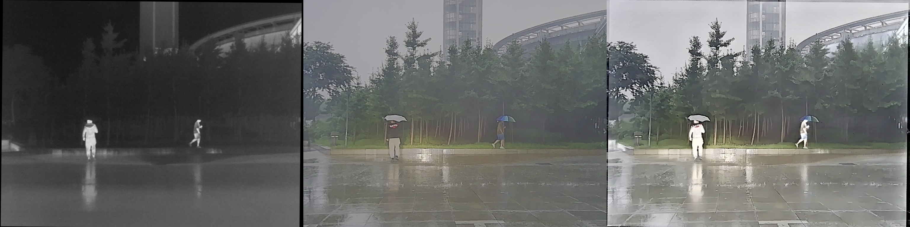

# LDFusion: Infrared and Visible Image Fusion with Language-driven Loss in CLIP Embedding Space

[Yuhao Wang](https://github.com/wyhlaowang), [Lingjuan Miao](https://github.com/wyhlaowang/LDFusion), [Zhiqiang Zhou](https://github.com/bitzhouzq), [Lei Zhang](https://github.com/ZhangLeiiiii), [Yajun Qiao](https://github.com/QYJ123/)




* Natural language is used to express the fusion objective, which can avoid the explicit mathematical modeling of fusion output in current losses. 

* A language-driven fusion model is constructed in the embedding space, by establishing the relationship among the embedded vectors representing the fusion objective and input image modalities. 

* A language-driven loss is derived to make the actual infrared-visible image fusion aligned with the embedded language-driven fusion model via supervised training. 

* Our model does not require any text input during the inference stage.

# Usage
## 1. Create Environment
* create conda environment
```
conda create -n LDFusion python=3.9.12
conda activate LDFusion
```

* Install Dependencies 
```
pip install -r requirements.txt
```
(recommended cuda11.1 and torch 1.8.2)

## 2. Data Preparation and Running
Please put test data into the ```test_imgs``` directory (infrared images in ```ir``` subfolder, visible images in ```vi``` subfolder), and run ```python src/test.py```. 

(Note: The weight files (*.pt) might require independent download from the repository)

Then, the fused results will be saved in the ```./results/``` folder. 

# Examples
From left to right are the infrared image, visible image, and the fused image generated by LDFusion.




# Abstract
Infrared-visible image fusion (IVIF) has attracted much attention owing to the highly-complementary properties of the two image modalities. Due to the lack of ground-truth fused images, the fusion output of current deep-learning based methods heavily depends on the loss functions defined mathematically. As it is hard to well mathematically define the fused image without ground truth, the performance of existing fusion methods is limited. In this paper, we first propose to use natural language to express the objective of IVIF, which can avoid the explicit mathematical modeling of fusion output in current losses, and make full use of the advantage of language expression to improve the fusion performance. For this purpose, we present a comprehensive language-expressed fusion objective, and encode relevant texts into the multi-modal embedding space using CLIP. A language-driven fusion model is then constructed in the embedding space, by establishing the relationship among the embedded vectors representing the fusion objective and input image modalities. Finally, a language-driven loss is derived to make the actual IVIF aligned with the embedded language-driven fusion model via supervised training. Experiments show that our method can obtain much better fusion results than existing techniques. 

