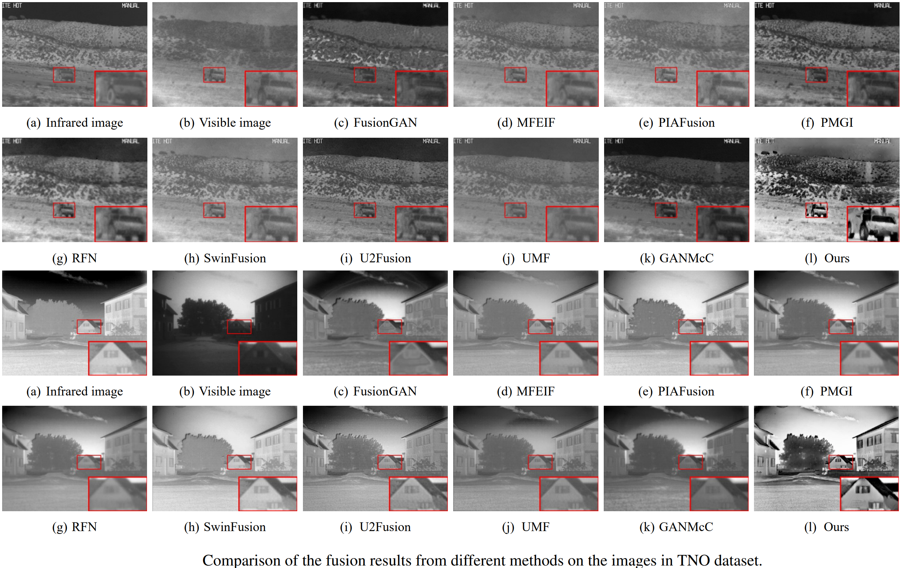
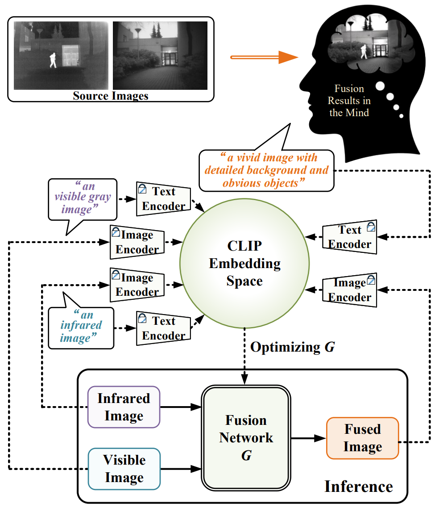
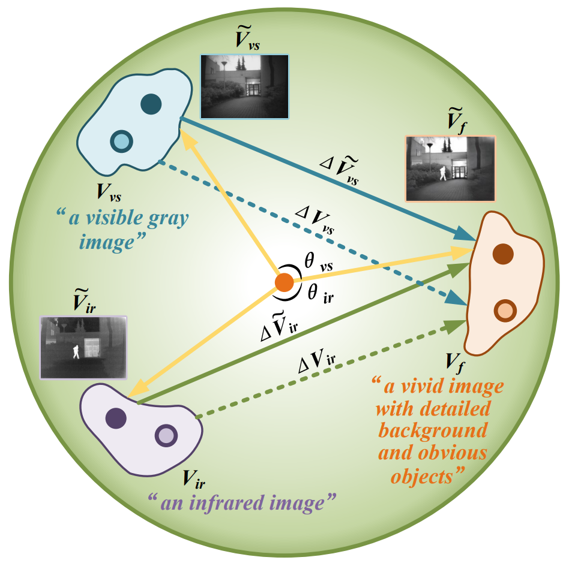

# LDFusion

code for LDFusion: Infrared and visible Image Fusion with Language-driven Loss in CLIP Embedding Space

[Yuhao Wang](https://github.com/wyhlaowang), [Lingjuan Miao](https://github.com/wyhlaowang/LDFusion), [Zhiqiang Zhou](https://github.com/bitzhouzq), [Lei Zhang](https://github.com/ZhangLeiiiii), [Yajun Qiao](https://github.com/QYJ123/)

[arxiv] (https://arxiv.org/abs/2402.16267)


# Citation
```
@article{wang2024infrared,
        title    =  {Infrared and visible Image Fusion with Language-driven Loss in CLIP Embedding Space},
        author   =  {Wang, Yuhao and Miao, Lingjuan and Zhou, Zhiqiang and Zhang, Lei and Qiao, Yajun},
        journal  =  {arXiv preprint arXiv:2402.16267},
        year     =  {2024}
}
```


# Usage
**1. Create Environment**
```
# install cuda
Recommended cuda11.1

# create conda environment
conda create -n LDFusion python=3.9.12
conda activate LDFusion

# select pytorch version yourself (recommended torch 1.8.2)
# install DDFM requirements
pip install -r requirements.txt
```

**2. Data Preparation, inference and training**
You can put your own test data directly into the ```test_imgs/TNO_test``` directory, and run ```python src/test.py```.

Then, the fused results will be saved in the ```./self_results/TNO_test/``` folder.

If you train this network with single GPU, please change the parameter ```MUL_GPU``` in ```trainer.py``` to ```False```, and run ```python src/trainer.py``` in the project directory.

If multiple GPUs are used, you can run the following commands (the parameters in the commands need to be adjusted according to the hardware environment):
```CUDA_VISIBLE_DEVICES=0,1 OMP_NUM_THREADS=8 python -m torch.distributed.launch --nproc_per_node=2 --node_rank=0 src/trainer.py```

# Fusion Results
Fused images on the TNO dataset


Fused images on the ROADSCENE dataset



# LDFusion
The Framework of the proposed method. The dashed line represents the language-driven training process, while the solid box shows the inference process.



The schematics of the fusion process in CLIP embedding space. 




# Abstract
Infrared-visible image fusion (IVIF) has attracted much attention owing to the highly-complementary properties of the two image modalities. Due to the lack of ground-truth fused images, the fusion output of current deep-learning based methods heavily depends on the loss functions defined mathematically. As it is hard to well mathematically define the fused image without ground truth, the performance of existing fusion methods is limited. In this paper, we first propose to use natural language to express the objective of IVIF, which can avoid the explicit mathematical modeling of fusion output in current losses, and make full use of the advantage of language expression to improve the fusion performance. For this purpose, we present a comprehensive language-expressed fusion objective, and encode relevant texts into the multi-modal embedding space using CLIP. A language-driven fusion model is then constructed in the embedding space, by establishing the relationship among the embedded vectors representing the fusion objective and input image modalities. Finally, a language-driven loss is derived to make the actual IVIF aligned with the embedded language-driven fusion model via supervised training. Experiments show that our method can obtain much better fusion results than existing techniques. 