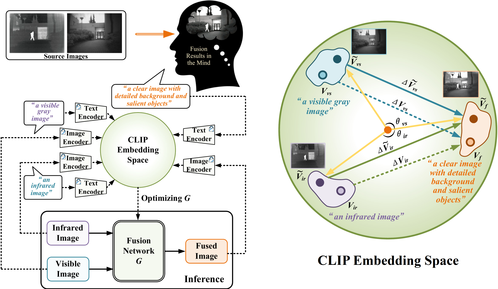
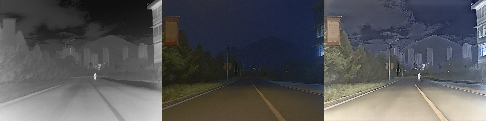
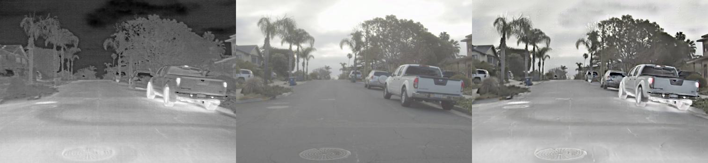

# [LDFusion] Official Implementation for "Infrared and Visible Image Fusion with Language-driven Loss in CLIP Embedding Space"

### 🧠 Pioneeringly Use **Natural Language** to Express Imgae Fusion Objective 

### ✍️ Avoid Complex and Explicit Mathematical Modeling in Fusion Loss 

<!--
[Yuhao Wang](https://github.com/wyhlaowang), [Lingjuan Miao](https://github.com/wyhlaowang/LDFusion), [Zhiqiang Zhou](https://github.com/bitzhouzq), [Lei Zhang](https://github.com/ZhangLeiiiii), [Yajun Qiao](https://github.com/QYJ123/)

<p align="center">
    
</p>
 -->

# ⚙️ Installation
## Prerequisites
- Python 3.9 or higher
- PyTorch 1.8.2 or higher
- CUDA 11.1 or higher

## 1. Create a New Conda environment:

```
conda create -n LDFusion python=3.9
conda deactivate
conda activate LDFusion
```

## 2. Install PyTorch with CUDA support:
```
pip3 install torch==1.8.2 torchvision==0.9.2 torchaudio==0.8.2 --extra-index-url https://download.pytorch.org/whl/lts/1.8/cu111
```
(Recommended: CUDA 11.1 and Torch 1.8.2.)

## 3. Clone the repository and install the package:
```
https://github.com/wyhlaowang/LDFusion.git

pip install -r requirements.txt
```

# 🚀 Getting Started

## ❄️ Inference

1. Please put test data into the ```test_imgs``` directory 

(infrared images in ```ir``` subfolder, visible images in ```vi``` subfolder)

2. run ```python src/test.py```

The fused results will be saved in the ```./results/``` folder. 

## 🔥 Training

1. Please modify the `data_dir` parameter in **dataset.py** to point to your dataset directory

2. start training

It is recommended to use **multi-GPU training**:

```
CUDA_VISIBLE_DEVICES=0,1,2,3 OMP_NUM_THREADS=32 python -m torch.distributed.launch --nproc_per_node=4 --node_rank=0 src/trainer.py
```

For single-GPU training, run:

```
python src/trainer.py
```


# 💡 Examples
From left to right are the infrared image, visible image, and the fused image generated by LDFusion.

<p align="center">


</p>

<!--
# Citation
If you find our work or codes useful for your research, please cite the papers as follows:

```
@inproceedings{wang2025language,
author = {Wang, Yuhao and Miao, Lingjuan and Zhou, Zhiqiang and Zhang, Lei and Yajun, Qiao},
title = {Infrared and Visible Image Fusion with Language-Driven Loss in CLIP Embedding Space},
year = {2025},
booktitle = {Proceedings of the 33rd ACM International Conference on Multimedia},
}
```
 -->
