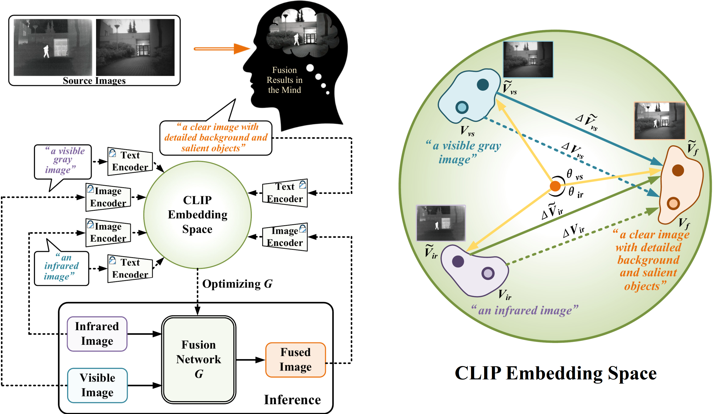
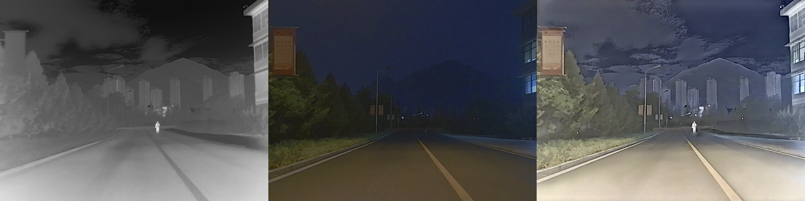

# [LDFusion] Official implementation for "Infrared and Visible Image Fusion with Language-driven Loss in CLIP Embedding Space"

<!--
# LDFusion: Infrared and Visible Image Fusion with Language-driven Loss in CLIP Embedding Space

[Yuhao Wang](https://github.com/wyhlaowang), [Lingjuan Miao](https://github.com/wyhlaowang/LDFusion), [Zhiqiang Zhou](https://github.com/bitzhouzq), [Lei Zhang](https://github.com/ZhangLeiiiii), [Yajun Qiao](https://github.com/QYJ123/)




* We first propose to use nature language to express the whole objective of IVIF, which allows to avoid the complex and explicit mathematical modeling in current fusion loss functions.
  
* A language-driven fusion model is derived in CLIP embedding space, based on which we develop a simple yet highly effective language-driven loss for IVIF. Particularly, by introducing a novel regularization and patch filtering approach, we ensure high robustness of the trained model in practice and resolve the challenge of removing textual artifacts induced by CLIP.
  
* Experiments show a great improvement of fusion quality achieved by the proposed method, revealing the superiority of language in modeling of the fusion output and the potential of pre-trained vision-language model in improving the IVIF performance. 
 -->
 
# Usage
## 1. Create Environment
* create conda environment
```
conda create -n LDFusion python=3.9.12
conda activate LDFusion
```

* Install Dependencies 
```
pip install -r requirements.txt
```
(recommended cuda11.1 and torch 1.8.2)

## 2. Inference

Please put test data into the ```test_imgs``` directory (infrared images in ```ir``` subfolder, visible images in ```vi``` subfolder), and run 

```
python src/test.py
```

Then, the fused results will be saved in the ```./results/``` folder. 


## 3. Training

Please modify the `data_dir` in **dataset.py** to point to your dataset directory, then start training.

It is recommended to use **multi-GPU training**:

```
CUDA_VISIBLE_DEVICES=0,1,2,3 OMP_NUM_THREADS=32 python -m torch.distributed.launch --nproc_per_node=4 --node_rank=0 src/trainer.py
```

For single-GPU training, run:

```
python src/trainer.py
```


# Examples
From left to right are the infrared image, visible image, and the fused image generated by LDFusion.




